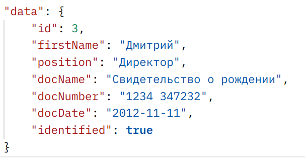
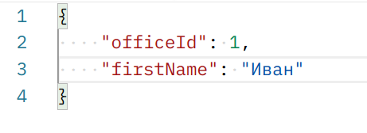
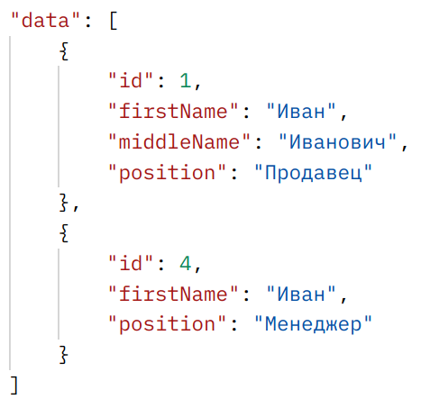
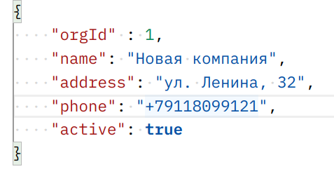
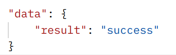
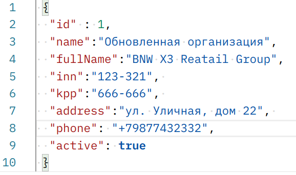
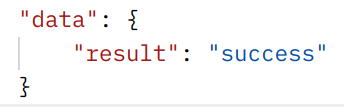

# Bell Integrator study project
Данный проект выполнен в рамках онлайн-стажировки в компании "Bell Integrator". <br/>
Проект представляет собой API web-сервис для сохранения, обновления и получения списка пользователей, офисов и организаций. <br/>
Проект написан с использованием Spring Boot, JDBC, JPA, REST API. <br/>
В качестве базы даннных исользуется H2. <br/>
Сборка проекта и управление зависимостями осуществляется с помощью Maven. <br/>
Версия Java - 17. <br/>

## Запуск проекта
Для того, чтобы запустить данный проект, необходимо скопировать репозиторий к себе на компьютер, 
следующей командой в терминале.
### Command
```bash
git clone https://github.com/LastDi/bell
```

# Примеры некоторых запросов и ответов
GET запрос для получения пользователя по id (Например id = 3):
```bash
http://localhost:8080/api/user/3
```
Ответ: 
<br/>

<p align="center">
  
</p>


POST запрос для получения списка пользователей по фильтру:
```bash
http://localhost:8080/api/user/list
```

<br/>
Ответ: 
<br/>


POST запрос для сохранения офиса
```bash
http://localhost:8080/api/office/save
```

<br/>
Ответ: 
<br/>


POST запрос для обновления данных организации
```bash
http://localhost:8080/api/organization/update
```

<br/>
Ответ:
<br/>



